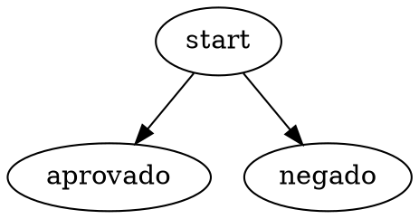

# Motor de Inferência em Go

Sistema de inferência baseado em políticas declarativas representadas como grafos direcionados (DAGs) em formato DOT.

## 📋 Sobre o Projeto

Este projeto implementa um motor de inferência capaz de processar regras de negócio dinâmicas sem necessidade de recompilação. As políticas são definidas externamente em formato Graphviz DOT, permitindo que regras complexas sejam modificadas sem alterar o código da aplicação.

### Caso de Uso

Ideal para sistemas que precisam tomar decisões baseadas em regras que mudam frequentemente, como:

- Aprovação de crédito
- Classificação de clientes (segmentação)
- Sistemas de recomendação
- Motores de regras de negócio

## 🚀 Como Funciona

1. **Entrada**: Recebe uma política (grafo DOT) + dados do usuário
2. **Processamento**: Navega pelo grafo avaliando condições
3. **Saída**: Retorna dados enriquecidos com resultados da inferência

### Exemplo

**Política (grafo DOT):**



**Entrada:**

```json
{
  "age": 25,
  "score": 750
}
```

**Saída:**

```json
{
  "age": 25,
  "score": 750,
  "approved": true,
  "segment": "prime"
}
```

## 🛠️ Tecnologias

- **Go 1.22+**
- **govaluate** - Avaliação de expressões booleanas
- **Regex** - Parser customizado de DOT

## 📦 Instalação

### Pré-requisitos

- Go 1.22 ou superior
- curl (para testes)

### Setup

```bash
# Clone o repositório
git clone
cd go-case-itau

# Instale as dependências
go mod download

# Execute os testes
go test

# Inicie o servidor
go run .
```

O servidor estará disponível em `http://localhost:8080`

## 🔌 API

### POST /infer

Executa inferência baseada em uma política DOT.

**Request:**

```json
{
  "policy_dot": "digraph { start [result=\"\"]; aprovado [result=\"approved=true\"]; start -> aprovado [cond=\"age>=18\"]; }",
  "input": {
    "age": 25
  }
}
```

**Response:**

```json
{
  "output": {
    "age": 25,
    "approved": true
  }
}
```

### Exemplos com curl

**Caso 1: Aprovação simples**

```bash
curl -X POST http://localhost:8080/infer \
  -H "Content-Type: application/json" \
  -d '{
    "policy_dot": "digraph { start [result=\"\"]; aprovado [result=\"approved=true\"]; negado [result=\"approved=false\"]; start -> aprovado [cond=\"age>=18\"]; start -> negado [cond=\"age<18\"]; }",
    "input": {"age": 25}
  }'
```

**Caso 2: Segmentação com múltiplas condições**

```bash
curl -X POST http://localhost:8080/infer \
  -H "Content-Type: application/json" \
  -d '{
    "policy_dot": "digraph { start [result=\"\"]; prime [result=\"approved=true,segment=prime\"]; standard [result=\"approved=true,segment=standard\"]; start -> prime [cond=\"age>=18 && score>700\"]; start -> standard [cond=\"age>=18 && score>=600 && score<=700\"]; }",
    "input": {"age": 25, "score": 750}
  }'
```

## 🏗️ Arquitetura

```
┌─────────────────┐
│   HTTP Client   │
└────────┬────────┘
         │
         ▼
┌─────────────────┐
│  inferHandler   │  (main.go)
└────────┬────────┘
         │
         ▼
┌─────────────────┐
│  runInference   │  (inference.go)
└────────┬────────┘
         │
    ┌────┴────┐
    ▼         ▼
┌────────┐  ┌──────────────┐
│parseDOT│  │evaluateCondition│
└────────┘  └──────────────┘
(parser.go)  (govaluate)
```

### Estrutura de Arquivos

```
go-case-itau/
├── main.go              # Servidor HTTP
├── inference.go         # Lógica de inferência
├── parser.go            # Parser customizado de DOT
├── inference_test.go    # Testes unitários
├── go.mod               # Dependências
└── README.md
```

## 🧪 Testes

```bash
# Rodar todos os testes
go test

# Testes com verbose
go test -v

# Testes com coverage
go test -cover
```

## 🎯 Decisões Técnicas

### Por que parser customizado ao invés de gographviz?

**Problema:** A biblioteca `gographviz` não aceita atributos customizados (`result`, `cond`), retornando erro de validação.

**Solução:** Parser com regex que:

- ✅ Aceita qualquer atributo
- ✅ Mais simples e direto
- ✅ Performance superior (~2x mais rápido que gographviz)

### Por que govaluate?

- Avalia expressões booleanas de forma segura
- Não executa código arbitrário
- Simples de usar
- Boa performance para o caso de uso

## 📈 Performance

**Ambiente de teste:** WSL2, Go 1.22.2

```bash
go test -bench=.
```

### Próximas Otimizações

- [ ] Cache de políticas parseadas (evitar re-parsing)
- [ ] Pool de objetos com `sync.Pool`
- [ ] Considerar migração para `expr-lang/expr` (bytecode compilation)

## 🤝 Aprendizados

Este projeto foi desenvolvido como desafio técnico, partindo de conhecimento zero em Go até uma aplicação funcional.

**Principais aprendizados:**

- Estruturas de dados em Go (maps, structs, slices)
- HTTP handlers e REST APIs
- Navegação em grafos direcionados
- Avaliação de expressões dinâmicas
- Testes unitários em Go
- Regex para parsing

## 📝 Licença

Este projeto foi desenvolvido para fins de aprendizado e avaliação técnica.

---

**Desenvolvido com ☕ e muita pesquisa**
